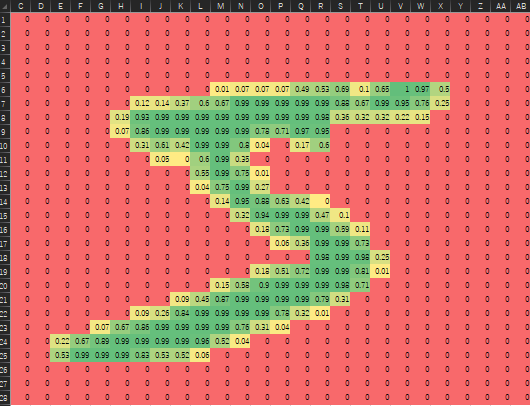

授業課題で実装を行ったので、備忘録として  
ディープラーニングのフレームワークを一切使わず、C++で行列演算からバックプロパゲーションまでを自前実装し、MNIST手書き数字を分類する

repo: https://github.com/romophic/MNIST_cpp


## 1. 原理
構築したニューラルネットワークの中でデータがどのように処理されるかを説明する。

### 1.1 入力から出力までの流れ
ニューラルネットワークは、複数の層が重なってできている。データは入力層から隠れ層、そして出力層へと一方向に流れていく。これを**順伝搬**と言う。


ある層から次の層へデータが伝わるとき、それぞれの信号は重みによって強さが変えられる。
入力データを $\bm{x}$、次の層へ伝わる信号を $\bm{u}$、重みをまとめた行列を $\bm{W}$ とすると、この関係は以下のように単純な行列の積で表せる。

$$
\bm{u} = \bm{W} \bm{x}
$$

この式は、前の層の全ニューロンからの信号が、それぞれ重みを掛けられて次の層のニューロンに集まってくることを意味している。
集まってきた信号 $\bm{u}$ は、そのまま次の層へ送られるのではなく、活性化関数と呼ばれるフィルターを通る。これがニューロンの発火（信号を次に伝えるか）を決める役割を果たす。本実験では2種類の関数を使用した。


隠れ層では**ReLU関数**を用いた。これは入力が負の値なら0を出力し、正の値ならそのまま出力するという働きをする。

$$
f(x) = \max(0, x)
$$

これにより、不要な情報をカットし、重要な特徴だけを次の層へ伝えることができる。計算が非常に単純であるため、学習が速く進むという利点がある。

最後の出力層では**Sigmoid関数**を用いた。これはどんな値が来ても $0$ から $1$ の間の数値に変換する。

$$
f(x) = \frac{1}{1 + e^{-x}}
$$

出力が $0$ から $1$ の間に収まるため、その数字である確率として解釈することができる。

### 1.2 学習の仕組み（誤差逆伝播）
最初は重み $\bm{W}$ がランダムな値になっているため、正しい答えが出ない。そこで、ネットワークが出した答えと、教師データとの誤差を計算する。
この誤差を小さくするように、出力層から入力層に向かって逆方向に重みを少しずつ修正していく。これを繰り返すことで、ニューラルネットワークは徐々に正しい判断ができるようになっていく。


---

## 2. 手法
実装にはC++23およびコンパイラとしてClang version 21.1.7を使用した。行列計算にはEigenライブラリを使用した。
本実験で構築したモデルの詳細は以下の通りである。

* **入力層**: 784ノード（$28 \times 28$ピクセルの画像データに対応）
* **隠れ層**: 128ノード（活性化関数: ReLU）
* **出力層**: 10ノード（活性化関数: Sigmoid、数字の0〜9に対応）

学習をスムーズに開始するため、重みの初期値は慎重に決める必要がある。
隠れ層の重み初期化にはHe初期化を、出力層の重み初期化にはXavier初期化という手法を用いた。これはデータのバラつき具合を保つように乱数を設定する方法で、これを用いることで学習が途中で止まってしまうことを防いでいる。

### 2.1 学習アルゴリズム
学習部分のソースコードを段階に分けて説明する。以下は、ニューラルネットワークを扱う `class NeuralNetwork` の実装の概要である。

**リスト1: NeuralNetworkクラスの実装（概要）**
```cpp
class NeuralNetwork {
 private:
  Eigen::MatrixXd w_ih;            // 入力層 → 隠れ層の重み
  Eigen::MatrixXd w_ho;            // 隠れ層 → 出力層の重み
  Eigen::VectorXd hidden_outputs;  // 隠れ層の出力

 public:
  // 初期化
  NeuralNetwork();
  // 順伝播を行う
  Eigen::VectorXd query(const Eigen::VectorXd& _inputs);
  // 学習
  void train(const Eigen::VectorXd& _inputs, const Eigen::VectorXd& _targets) {}
};
```

変数として入力層・隠れ層・出力層の重み行列を持つ。続いて、以下に初期化を行う `NeuralNetwork` の内容を記す。

**リスト2: 初期化の実装**
```cpp
NeuralNetwork() {
  // 隠れ層
  double weight_scale_ih = sqrt(2.0 / INPUT_NODES); // He初期化係数
  w_ih = Eigen::MatrixXd::Random(HIDDEN_NODES, INPUT_NODES) * weight_scale_ih; // He初期化
  // 出力層
  double weight_scale_ho = sqrt(1.0 / HIDDEN_NODES);  // Xavier初期化係数
  w_ho = Eigen::MatrixXd::Random(OUTPUT_NODES, HIDDEN_NODES) * weight_scale_ho;  // Xavier初期化
}
```

以下に順伝搬を行う関数 `query` の内容を示す。

**リスト3: 順伝播の実装**
```cpp
// 順伝播を行う
Eigen::VectorXd query(const Eigen::VectorXd& _inputs) {
  // 隠れ層
  Eigen::VectorXd hidden_inputs = w_ih * _inputs;   // 重み行列と入力行列を掛けた結果を出力とする
  hidden_outputs = hidden_inputs.unaryExpr(&relu);  // 出力にReluを適応する

  // 出力層
  Eigen::VectorXd final_inputs =
      w_ho * hidden_outputs;  // 重み行列と隠れ層の出力行列を掛けた結果を出力とする
  Eigen::VectorXd final_outputs = final_inputs.unaryExpr(&sigmoid);  // 出力にSigmoidを適応する
  return final_outputs;
}
```

最後に、学習を行う部分である `train` の実装を説明する。

**リスト4: 学習（誤差逆伝播）の実装**
```cpp
// 学習
void train(const Eigen::VectorXd& _inputs, const Eigen::VectorXd& _targets) {
  Eigen::VectorXd final_outputs = query(_inputs);  // 順伝搬

  Eigen::VectorXd output_errors = _targets - final_outputs;          // 誤差計算
  Eigen::VectorXd hidden_errors = w_ho.transpose() * output_errors;  // 隠れ層の誤差計算

  // 出力層の勾配
  Eigen::VectorXd output_gradients =
      output_errors.cwiseProduct(final_outputs.unaryExpr(&sigmoid_d));
  w_ho += LEARNING_RATE * (output_gradients * hidden_outputs.transpose());  // 出力層の重み更新

  // 隠れ層の勾配
  Eigen::VectorXd hidden_gradients =
      hidden_errors.cwiseProduct(hidden_outputs.unaryExpr(&relu_d));
  w_ih += LEARNING_RATE * (hidden_gradients * _inputs.transpose());  // 隠れ層の重み更新
}
```

### 2.2 MNISTデータセットの読み込み
MNISTデータセットは、以下の4つのファイルから構成されている。これらはビッグエンディアン形式で記録されているため、4バイトずつ読み込み、バイト順を反転させて数値を再構成する処理が必要となる。

* `train-images-idx3-ubyte`: 学習用画像データ
* `train-labels-idx1-ubyte`: 学習用ラベルデータ
* `t10k-images-idx3-ubyte`: テスト用画像データ
* `t10k-labels-idx1-ubyte`: テスト用ラベルデータ

画像データ本体はヘッダの後に続いており、各ピクセルが0から255の値で格納されている。読み込み時に全ピクセル値を255で割り、正規化して入力データとした。



### 2.3 ソースコード
以下に実験で使用したソースコード全文を記す。

**リスト5: main.cpp（全文）**
```cpp
#include <algorithm>
#include <cmath>
#include <cstdlib>
#include <fstream>
#include <iostream>
#include <vector>

#include "Eigen/Core"
#include "Eigen/Dense"

using namespace std;

constexpr int INPUT_NODES = 784;        // 入力層のノード数
constexpr int HIDDEN_NODES = 128;       // 隠れ層のノード数
constexpr int OUTPUT_NODES = 10;        // 出力層のノード数
constexpr double LEARNING_RATE = 0.01;  // 学習率
constexpr int EPOCHS = 10;              // エポック数

double sigmoid(double _x) { return 1.0 / (1.0 + exp(-_x)); }  // sigmoid関数
double sigmoid_d(double _x) { return _x * (1.0 - _x); }       // sigmoidの微分

double relu(double _x) { return max(0.0, _x); }            // relu関数
double relu_d(double _y) { return _y > 0.0 ? 1.0 : 0.0; }  // reluの微分

class NeuralNetwork {
 private:
  Eigen::MatrixXd w_ih;            // 入力層 -> 隠れ層の重み
  Eigen::MatrixXd w_ho;            // 隠れ層 -> 出力層の重み
  Eigen::VectorXd hidden_outputs;  // 隠れ層の出力

 public:
  // 初期化
  NeuralNetwork() {
    // 隠れ層
    double weight_scale_ih = sqrt(2.0 / INPUT_NODES);                             // He初期化係数
    w_ih = Eigen::MatrixXd::Random(HIDDEN_NODES, INPUT_NODES) * weight_scale_ih;  // He初期化

    // 出力層
    double weight_scale_ho = sqrt(1.0 / HIDDEN_NODES);  // Xavier初期化係数
    w_ho = Eigen::MatrixXd::Random(OUTPUT_NODES, HIDDEN_NODES) * weight_scale_ho;  // Xavier初期化
  }

  // 順伝播を行う
  Eigen::VectorXd query(const Eigen::VectorXd& _inputs) {
    // 隠れ層
    Eigen::VectorXd hidden_inputs = w_ih * _inputs;   // 重み行列と入力行列を掛けた結果を出力とする
    hidden_outputs = hidden_inputs.unaryExpr(&relu);  // 出力にReluを適応する

    // 出力層
    Eigen::VectorXd final_inputs =
        w_ho * hidden_outputs;  // 重み行列と隠れ層の出力行列を掛けた結果を出力とする
    Eigen::VectorXd final_outputs = final_inputs.unaryExpr(&sigmoid);  // 出力にSigmoidを適応する
    return final_outputs;
  }

  // 学習
  void train(const Eigen::VectorXd& _inputs, const Eigen::VectorXd& _targets) {
    Eigen::VectorXd final_outputs = query(_inputs);  // 順伝搬

    Eigen::VectorXd output_errors = _targets - final_outputs;          // 誤差計算
    Eigen::VectorXd hidden_errors = w_ho.transpose() * output_errors;  // 隠れ層の誤差計算

    // 出力層の勾配
    Eigen::VectorXd output_gradients =
        output_errors.cwiseProduct(final_outputs.unaryExpr(&sigmoid_d));
    w_ho += LEARNING_RATE * (output_gradients * hidden_outputs.transpose());  // 出力層の重み更新

    // 隠れ層の勾配
    Eigen::VectorXd hidden_gradients =
        hidden_errors.cwiseProduct(hidden_outputs.unaryExpr(&relu_d));
    w_ih += LEARNING_RATE * (hidden_gradients * _inputs.transpose());  // 隠れ層の重み更新
  }
};

int read_int(ifstream& file) {
  unsigned char bytes[4];
  file.read((char*)bytes, 4);
  return (bytes[0] << 24) | (bytes[1] << 16) | (bytes[2] << 8) | bytes[3];
}

void load_mnist(const string& _image_path, const string& _label_path,
                vector<Eigen::VectorXd>& _images, vector<int>& _labels) {
  ifstream img_file(_image_path, ios::binary);
  ifstream lbl_file(_label_path, ios::binary);

  if (not(img_file.is_open() and lbl_file.is_open())) exit(1);

  read_int(img_file);

  int num_items = read_int(img_file);
  int rows = read_int(img_file);
  int cols = read_int(img_file);

  cout << "num_items: " << num_items << endl;
  cout << "rows: " << rows << endl;
  cout << "cols: " << cols << endl;

  read_int(lbl_file);
  read_int(lbl_file);

  _images.reserve(num_items);
  _labels.resize(num_items);

  for (int i = 0; i < num_items; ++i) {
    unsigned char label;
    lbl_file.read((char*)&label, 1);
    _labels[i] = (int)label;
    Eigen::VectorXd img_vec(rows * cols);
    for (int j = 0; j < rows * cols; ++j) {
      unsigned char pixel;
      img_file.read((char*)&pixel, 1);
      img_vec[j] = pixel / 255.0;
    }
    _images.emplace_back(img_vec);
  }
}

int main() {
  vector<Eigen::VectorXd> train_images, test_images;
  vector<int> train_labels, test_labels;

  load_mnist("train-images.idx3-ubyte", "train-labels.idx1-ubyte", train_images, train_labels);
  load_mnist("t10k-images.idx3-ubyte", "t10k-labels.idx1-ubyte", test_images, test_labels);

  NeuralNetwork nn;

  for (int epoch = 1; epoch <= EPOCHS; ++epoch) {
    for (size_t i = 0; i < train_images.size(); ++i) {
      Eigen::VectorXd targets = Eigen::VectorXd::Constant(OUTPUT_NODES, 0.01);
      targets[train_labels[i]] = 0.99;
      nn.train(train_images[i], targets);
    }
    cout << "Epoch " << epoch << " done" << endl;
  }

  int correct_count = 0;
  for (size_t i = 0; i < test_images.size(); ++i) {
    Eigen::VectorXd outputs = nn.query(test_images[i]);
    int predicted_label;
    outputs.maxCoeff(&predicted_label);
    if (predicted_label == test_labels[i])
      correct_count++;
  }

  double accuracy = (double)correct_count / test_images.size() * 100.0;
  cout << "Accuracy: " << accuracy << "%" << endl;

  return 0;
}
```

**コンパイルコマンド:**
```bash
clang++ -std=c++23 -O3 -march=native main.cpp
```

---

## 3. 結果
学習用データ60,000枚を使って10エポックの学習を行い、テストデータ10,000枚で正解率を測定した。認識精度は約**97.53%**となり、高い精度を確認した。

---

## 4. 考察
* **活性化関数**: 隠れ層のReLUにより勾配消失を回避し、効率的な学習を実現した。
* **学習率**: 0.01という設定は、収束の安定性と速度において適切であった。

---

## 5. 参考文献
1. [C++日本語リファレンス](https://cpprefjp.github.io)
2. [Eigen Library](https://eigen.tuxfamily.org)
3. [MNIST バイナリファイル読み込み](https://tatsy.github.io/programming-for-beginners/python/read-binary)
4. [Qiita: C++で作るニューラルネットワーク](https://qiita.com/Luke02561/items/e68948da075893cff43d)