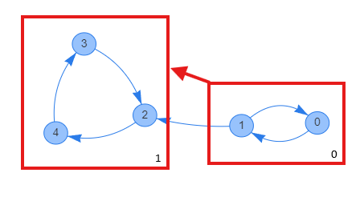

---
title: '強連結成分分解(SCC)'
date: 2024-07-30T22:01:37+09:00
description: 'romophic-library'
tags: ['c++', 'competitive programming']
authors: ['romophic']
lang: 'en'
---

## Purpose

Performs Strongly Connected Components (SCC) decomposition. It partitions and groups the graph into cyclable components, and creates a DAG of those components.

## Example

  
In the figure above, movement is mutually possible within group 0 and group 1 respectively, and movement between groups is only possible from group 0 to group 1. Intuitively, it is graph compression.

## Time Complexity

$ O(|V| + |E|) $

## Usage

### Declaration

```cpp
auto res = scc(g);
```

g is a `vector<vector<int>>`.  
Get the index of the strongly connected component to which vertex i belongs using `res.indexToContracted[i]`.  
Get the graph grouped by strongly connected components using `res.contractedGraph` (`vector<vector<int>>`).

The execution result for [Example](#example) is:

```cpp
res.indexToContracted = {
  0,0,1,1,1
}
```

```cpp
res.contractedGraph = {
  {1},
  {}
}
```

.

## Implementation

```cpp
struct scc_return {
  vector<vector<int>> contractedGraph;
  vector<int> indexToContracted;
};
scc_return scc(const vector<vector<int>> &_g) {
  vector<vector<int>> gg(_g.size()), rg(_g.size()), contracted;
  vector<int> comp(_g.size(), -1), order, used(_g.size());
  for (int i = 0; i < _g.size(); i++) {
    for (auto e : _g[i]) {
      gg[i].emplace_back(e);
      rg[e].emplace_back(i);
    }
  }
  auto dfs = [&](auto &&self, int idx) {
    if (used[idx])
      return;
    used[idx] = true;
    for (int to : gg[idx])
      self(self, to);
    order.push_back(idx);
  };
  auto rdfs = [&](auto &&self, int idx, int cnt) {
    if (comp[idx] != -1)
      return;
    comp[idx] = cnt;
    for (int to : rg[idx])
      self(self, to, cnt);
  };
  for (int i = 0; i < gg.size(); i++)
    if (!used[i])
      dfs(dfs, i);
  reverse(order.begin(), order.end());
  int ptr = 0;
  for (int i : order)
    if (comp[i] == -1)
      rdfs(rdfs, i, ptr), ptr++;
  contracted.resize(ptr);
  for (int i = 0; i < _g.size(); i++) {
    for (auto &to : _g[i]) {
      int x = comp[i], y = comp[to];
      if (x == y)
        continue;
      contracted[x].push_back(y);
    }
  }
  for (auto &v : contracted) {
    sort(v.begin(), v.end());
    v.erase(unique(v.begin(), v.end()), v.end());
  }
  return {contracted, comp};
}
```
